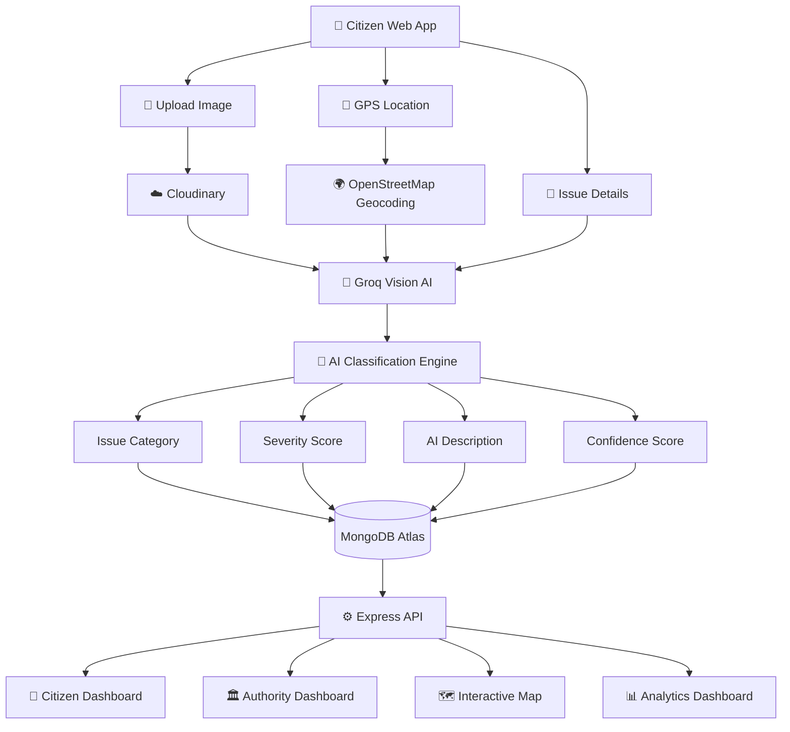
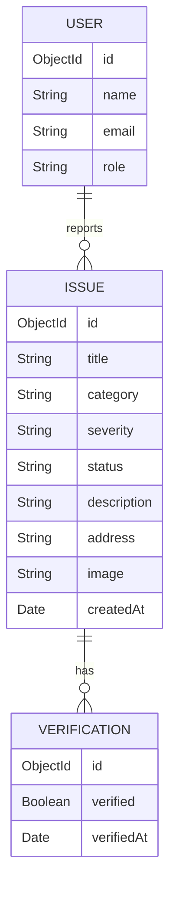

<!-- ========================================================= -->
<!--                       CIVICSENSE                           -->
<!-- ========================================================= -->

<div align="center">

# 🌍 CivicSense

### **AI-Powered Civic Issue Reporting & Community Intelligence Platform**

*Empowering citizens to build smarter cities through Artificial Intelligence, Community Verification, and Real-Time Civic Intelligence.*

---

<p>


</p>

---

### 🚀 Making Civic Issue Reporting Intelligent

Report • Detect • Classify • Prioritize • Resolve

</div>

---

## 🌟 Overview

CivicSense is an AI-powered civic intelligence platform that enables citizens to report infrastructure issues using photographs while automatically identifying, classifying, prioritizing, and routing complaints using computer vision and artificial intelligence.

Instead of manually reviewing thousands of complaints, CivicSense performs intelligent analysis on uploaded images and produces structured issue reports that help municipalities respond faster.

The platform bridges the communication gap between citizens and local authorities by combining:

- 🤖 AI Vision
- 📍 Smart Location Detection
- 🗺 Interactive Mapping
- 👥 Community Verification
- 📊 Administrative Analytics
- ⚡ Real-Time Tracking

---

# 🎯 Why CivicSense?

Cities receive thousands of complaints every month.

Many of them suffer from:

- Duplicate reports
- Missing information
- Incorrect categorization
- Slow response time
- Lack of transparency
- Poor prioritization
- Manual verification

CivicSense automates this entire workflow using AI.

---

# 💡 The Solution

CivicSense allows any citizen to simply:

📸 Take a Photo

↓

📍 Detect Location

↓

🤖 AI Classifies Issue

↓

🚦 Assign Severity

↓

🏢 Route to Authority

↓

📊 Track Progress

↓

✅ Resolution

The result is a smarter, faster, and more transparent civic issue management system.

---

# ✨ Core Capabilities

| Feature | Description |
|----------|-------------|
| 🤖 AI Vision | Automatically identifies civic issues from uploaded images |
| 📍 Smart GPS | Detects precise location with reverse geocoding |
| 🗺 Interactive Maps | Browse nearby issues with filtering |
| 👥 Community Verification | Citizens validate reported issues |
| 🚦 Smart Prioritization | AI calculates issue severity |
| 📊 Analytics Dashboard | Complete municipal monitoring dashboard |
| 🔒 Secure Authentication | Email/Password + Google OAuth |
| ☁ Cloud Image Storage | Reliable image hosting with CDN |
| ⚡ Real-Time Tracking | Track issue lifecycle instantly |

---

# 🚀 Key Highlights

<table>

<tr>

<td width="33%" align="center">

### 🤖 AI Powered

Automatically detects

- Potholes
- Garbage
- Water Leakage
- Air Pollution
- Streetlight Issues
- Road Damage

</td>

<td width="33%" align="center">

### 📍 Smart Location

Uses

- GPS
- Reverse Geocoding
- OpenStreetMap
- Interactive Maps

</td>

<td width="33%" align="center">

### 🏛 Authority Dashboard

Manage

- Complaints
- Statistics
- Verification
- Resolution
- Analytics

</td>

</tr>

</table>

---

# 🧠 Artificial Intelligence

Powered by

> **Groq Vision AI**

Model

```
meta-llama/llama-4-scout-17b-16e-instruct
```

Capabilities include:

- Image Understanding
- Civic Issue Detection
- Severity Prediction
- Category Classification
- Natural Language Description
- Non-Civic Image Detection

---

# 🎥 How CivicSense Works

```text
Citizen
   │
   ▼
Upload Photo
   │
   ▼
GPS Detection
   │
   ▼
Reverse Geocoding
   │
   ▼
Groq Vision AI
   │
   ▼
Issue Classification
   │
   ▼
Severity Analysis
   │
   ▼
Store in Database
   │
   ▼
Authority Dashboard
   │
   ▼
Community Verification
   │
   ▼
Resolution Tracking
```

---

# 📈 Platform Benefits

## 👨 Citizens

✔ Easy reporting

✔ Real-time status tracking

✔ Transparent resolution

✔ Community participation

✔ Interactive maps

---

## 🏛 Authorities

✔ Reduced manual workload

✔ Faster issue prioritization

✔ AI-assisted classification

✔ Centralized dashboard

✔ Better resource allocation

---

## 🌍 Cities

✔ Cleaner infrastructure

✔ Better public engagement

✔ Faster response time

✔ Data-driven governance

✔ Smarter urban management

---

# 📸 Project Preview

> Replace these placeholders with your actual screenshots before publishing.

| Dashboard | Issue Reporting |
|------------|-----------------|
| `docs/dashboard.png` | `docs/report.png` |

| AI Classification | Interactive Map |
|-------------------|-----------------|
| `docs/ai.png` | `docs/map.png` |

---

## ⭐ What Makes CivicSense Different?

Unlike traditional complaint portals, CivicSense combines Artificial Intelligence, Computer Vision, Geospatial Intelligence, and Community Participation into a unified civic intelligence platform.

Instead of merely storing complaints, the platform understands, prioritizes, and organizes them to help authorities make faster and better decisions.

---

---

# 🏗 System Architecture



---

# 🧠 AI Processing Pipeline


---

# ⚙️ Complete Workflow

```text
Citizen Opens CivicSense
           │
           ▼
Report Issue
           │
           ▼
Upload Photograph
           │
           ▼
Capture GPS Location
           │
           ▼
Reverse Geocoding
           │
           ▼
Cloudinary Upload
           │
           ▼
Groq Vision AI
           │
           ▼
Image Analysis
           │
           ▼
Issue Classification
           │
           ▼
Severity Assessment
           │
           ▼
Generate Description
           │
           ▼
Store in MongoDB
           │
           ▼
Authority Dashboard
           │
           ▼
Community Verification
           │
           ▼
Issue Resolution
```

---

# 🧠 AI Classification Engine

CivicSense uses **Groq Vision AI** powered by the **Meta Llama 4 Scout** model to intelligently analyze uploaded images.

### AI automatically determines

- Civic Issue Category
- Severity Level
- Human-readable Description
- Confidence Score
- Whether the image actually contains a civic issue

---

## Supported Categories

| Category | Examples |
|-----------|----------|
| 🛣 Potholes | Broken roads, cracks |
| 🗑 Garbage | Waste accumulation |
| 💧 Water Leakage | Pipe leaks, sewage |
| 🚦 Traffic Signal | Broken traffic lights |
| 💡 Streetlights | Faulty street lights |
| 🌧 Drainage | Flooding, clogged drains |
| 🚗 Illegal Parking | Unauthorized parking |
| 🏗 Encroachment | Illegal construction |
| 🌫 Air Pollution | Smoke, dust |
| 🔊 Noise Pollution | Loud public disturbances |
| 📦 Others | Miscellaneous civic issues |

---

# 📊 Severity Classification

AI predicts one of four severity levels.

| Level | Meaning |
|---------|---------|
| 🟢 Low | Minor inconvenience |
| 🟡 Medium | Needs attention |
| 🟠 High | Significant public impact |
| 🔴 Critical | Immediate action required |

Severity is calculated using:

- Image contents
- Issue category
- Community verification
- Time since reporting
- Location importance

---

# 🏛 Technology Stack

## Frontend

| Technology | Purpose |
|------------|----------|
| Next.js 14 | React Framework |
| TypeScript | Type Safety |
| Tailwind CSS | Styling |
| Zustand | State Management |
| Leaflet | Interactive Maps |
| OpenStreetMap | Mapping |
| React Hot Toast | Notifications |

---

## Backend

| Technology | Purpose |
|------------|----------|
| Node.js | Runtime |
| Express.js | REST API |
| MongoDB Atlas | Database |
| Mongoose | ODM |
| JWT | Authentication |
| Firebase Admin | Google OAuth |
| Cloudinary | Image Storage |

---

## Artificial Intelligence

| Service | Purpose |
|----------|----------|
| Groq Cloud | AI Inference |
| Llama 4 Scout | Vision Model |
| Prompt Engineering | Image Analysis |
| Confidence Scoring | Prediction Accuracy |

---

## Infrastructure

| Technology | Purpose |
|------------|----------|
| MongoDB Atlas | Cloud Database |
| Cloudinary CDN | Media Delivery |
| OpenStreetMap | Geolocation |
| Nominatim API | Reverse Geocoding |

---

# 📦 Project Structure

```text
civicsense
│
├── backend
│   ├── src
│   │   ├── config
│   │   ├── middleware
│   │   ├── models
│   │   ├── routes
│   │   ├── services
│   │   ├── seed
│   │   └── server.js
│   │
│   ├── package.json
│   └── .env
│
├── frontend
│   ├── src
│   │   ├── app
│   │   ├── components
│   │   ├── lib
│   │   ├── store
│   │   ├── styles
│   │   └── types
│   │
│   ├── public
│   ├── package.json
│   └── .env.local
│
├── docs
│
├── screenshots
│
├── assets
│
└── README.md
```

---

# 🗃 Database Overview



---

# 🔄 Request Lifecycle

```text
Citizen

↓

Issue Submission

↓

Image Upload

↓

Cloudinary

↓

Groq Vision AI

↓

AI Classification

↓

MongoDB

↓

Admin Dashboard

↓

Verification

↓

In Progress

↓

Resolved

↓

Citizen Notification
```

---

# 🔒 Security Architecture

✔ JWT Authentication

✔ Google OAuth

✔ Firebase Token Verification

✔ Protected API Routes

✔ Cloud Image Storage

✔ Secure Environment Variables

✔ MongoDB Validation

✔ Server-side Input Validation

✔ API Authentication

✔ HTTPS Ready

---

# ⚡ Performance Highlights

- AI classification in seconds
- Lightweight REST APIs
- Optimized Next.js App Router
- CDN-backed image delivery
- Fast map rendering
- Responsive mobile-first interface
- Cloud-native architecture
- Horizontally scalable backend

---

---

# 🚀 Getting Started

## 📋 Prerequisites

Before running CivicSense locally, ensure the following tools are installed.

| Requirement | Version |
|-------------|----------|
| Node.js | 18+ |
| npm | Latest |
| MongoDB Atlas | Free Tier Supported |
| Groq API Key | Required |
| Cloudinary Account | Required |
| Firebase Project | Optional (Google OAuth) |
| Git | Latest |

---

# ⚡ Quick Start

Clone the repository.

```bash
git clone https://github.com/your-username/civicsense.git

cd civicsense
```

---

## 📦 Backend Installation

```bash
cd backend

npm install
```

Start the backend server.

```bash
npm run dev
```

---

## 💻 Frontend Installation

```bash
cd frontend

npm install
```

Run the development server.

```bash
npm run dev
```

---

# 🔑 Environment Variables

## Backend

Create a `.env` file.

```env
PORT=5000

NODE_ENV=development

MONGODB_URI=

JWT_SECRET=

GROQ_API_KEY=

CLOUDINARY_CLOUD_NAME=

CLOUDINARY_API_KEY=

CLOUDINARY_API_SECRET=

FIREBASE_PROJECT_ID=

FIREBASE_CLIENT_EMAIL=

FIREBASE_PRIVATE_KEY=
```

---

## Frontend

Create

```
.env.local
```

```env
NEXT_PUBLIC_API_URL=http://localhost:5000/api

NEXT_PUBLIC_FIREBASE_API_KEY=

NEXT_PUBLIC_FIREBASE_AUTH_DOMAIN=

NEXT_PUBLIC_FIREBASE_PROJECT_ID=

NEXT_PUBLIC_FIREBASE_STORAGE_BUCKET=

NEXT_PUBLIC_FIREBASE_MESSAGING_SENDER_ID=

NEXT_PUBLIC_FIREBASE_APP_ID=
```

---

# 🧪 Running the Project

Start Backend

```bash
cd backend

npm run dev
```

Start Frontend

```bash
cd frontend

npm run dev
```

Application

```
Frontend

http://localhost:3000

Backend

http://localhost:5000
```

---

# 🌱 Seed Demo Data

Populate the database.

```bash
cd backend

npm run seed
```

Creates

- Demo Users
- Sample Civic Issues
- Categories
- Dashboard Statistics

---

# 👤 Demo Credentials

| Role | Email | Password |
|------|-------|----------|
| Admin | admin@civicsense.com | admin123 |
| Authority | authority@civicsense.com | auth123 |
| User | user@civicsense.com | user123 |

---

# 📡 REST API

## Authentication

| Method | Endpoint |
|---------|----------|
| POST | `/api/auth/register` |
| POST | `/api/auth/login` |
| POST | `/api/auth/firebase` |
| GET | `/api/auth/me` |

---

## Issues

| Method | Endpoint |
|---------|----------|
| GET | `/api/issues` |
| GET | `/api/issues/:id` |
| GET | `/api/issues/map` |
| POST | `/api/issues` |
| PATCH | `/api/issues/:id` |
| POST | `/api/issues/:id/verify` |

---

## AI Classification

| Method | Endpoint |
|---------|----------|
| POST | `/api/classify` |
| GET | `/api/classify/categories` |

---

## Dashboard

| Method | Endpoint |
|---------|----------|
| GET | `/api/stats/overview` |
| GET | `/api/stats/trends` |

---

# 🧪 Example API Response

```json
{
  "category": "pothole",
  "severity": "high",
  "confidence": 0.96,
  "description": "Large pothole detected in the center of the road.",
  "status": "pending"
}
```

---

# 📊 Application Modules

```
Authentication
        │
        ▼
Citizen Portal
        │
        ▼
Issue Reporting
        │
        ▼
AI Classification
        │
        ▼
Cloud Storage
        │
        ▼
MongoDB
        │
        ▼
Authority Dashboard
        │
        ▼
Community Verification
        │
        ▼
Analytics
```

---

# 📱 Responsive Design

Optimized for

- Desktop
- Laptop
- Tablet
- Android
- iPhone

---

# ⚡ Performance

| Metric | Target |
|----------|---------|
| Lighthouse Performance | 95+ |
| Accessibility | 100 |
| Best Practices | 100 |
| SEO | 100 |
| Mobile Responsive | ✅ |
| AI Classification | Seconds |
| API Response | Fast |
| Image Upload | CDN Accelerated |

---

# 🔒 Security

Authentication

- JWT
- Google OAuth

Validation

- Input Validation
- Request Validation
- MongoDB Validation

Infrastructure

- Environment Variables
- Cloudinary CDN
- Firebase Verification

---

# ☁ Deployment

## Backend

Deploy to

- Railway
- Render
- DigitalOcean
- Azure
- AWS

---

## Frontend

Deploy to

- Vercel
- Netlify

---

# 📈 Future Roadmap

## Phase 1

- Push Notifications
- Email Alerts
- SMS Alerts

---

## Phase 2

- AI Duplicate Detection
- Auto Department Assignment
- Better Severity Prediction

---

## Phase 3

- React Native App
- Progressive Web App
- Offline Reporting

---

## Phase 4

- Predictive Civic Analytics
- Heat Maps
- AI Recommendation Engine
- Municipal Integration

---

# 🤝 Contributing

We welcome contributions.

```bash
Fork Repository

↓

Create Feature Branch

↓

Commit Changes

↓

Push Branch

↓

Open Pull Request

↓

Code Review

↓

Merge
```

---

# 👥 Team

## Maharishee Ambati

Founder • Full Stack Developer • AI Engineer

Responsible for

- System Design
- Frontend
- Backend
- AI Integration
- Architecture

---

# 💙 Built Using

- Next.js
- TypeScript
- Node.js
- Express
- MongoDB
- Groq Vision AI
- Firebase
- Cloudinary
- Tailwind CSS
- Leaflet

---

# 🙏 Acknowledgements

Special thanks to

- Groq
- Meta Llama
- MongoDB Atlas
- OpenStreetMap
- Cloudinary
- Firebase
- Vercel
- Tailwind CSS

for providing excellent developer tools.

---

# 📄 License

Distributed under the **MIT License**.

See `LICENSE` for more information.

---

# ⭐ Support the Project

If you found CivicSense useful,

please consider

⭐ Starring the repository

🍴 Forking the project

🛠 Contributing

🐞 Reporting issues

📢 Sharing the project

---

<div align="center">

# 🌍 CivicSense

### Building Smarter Cities with Artificial Intelligence

Made with ❤️ using

Next.js • TypeScript • MongoDB • Groq AI • Firebase

---

**Empowering Citizens. Assisting Authorities. Transforming Cities.**

</div>
